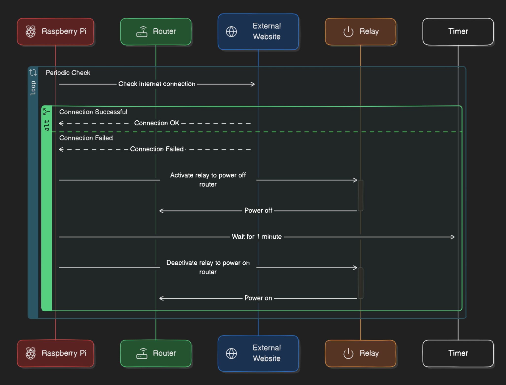

# pi-NetWatch
Harnesses the power of a Raspberry Pi to continuously monitor your home internet. In the event of an outage, it activates a relay to cold reboot the cable modem/router (assuming it is the problem), ensuring your connection is back online quickly.

You may explore other approaches like using an ESP32, smart plug or IFTTT device, etc.

## Net Watch Sequence 


## Bill of Materials (BOM)
1. **Raspberry Pi**
   - **Model:** Raspberry Pi 3, 4, or Zero W
   - **Quantity:** 1
   - **Description:** The main processing unit for running the monitoring script.
2. **Relay**
   - **Model:** HiLetgo 5V One Channel Relay Module Relay Switch with OPTO Isolation High Low Level Trigger
   - **Quantity:** 1
   - **Description:** Control the power of the model or router.

## Real Image


## Wiring Diagram

```plaintext
Raspberry Pi           Relay Module            Modem Power Adapter
+-------------+        +-------------+         +--------------+
|             |        |             |         |              |
|    5V   +---+--------> DC+ (b)     |         |              |
|   GND   +---+--------> DC- (w)     |         |              |
|  GPIO23 +---+--------> IN  (r)     |         |              |
|             |        |             |         |              |
|             |        |       COM  -+---------+--> Power Wire 1
|             |        |       NO   -+---------+--> Power Wire 2
+-------------+        +-------------+         +--------------+
```

### Raspberry Pi 

* 5V:  Pin 2
* GND: Pin 21
* GPIO: Pin 16


